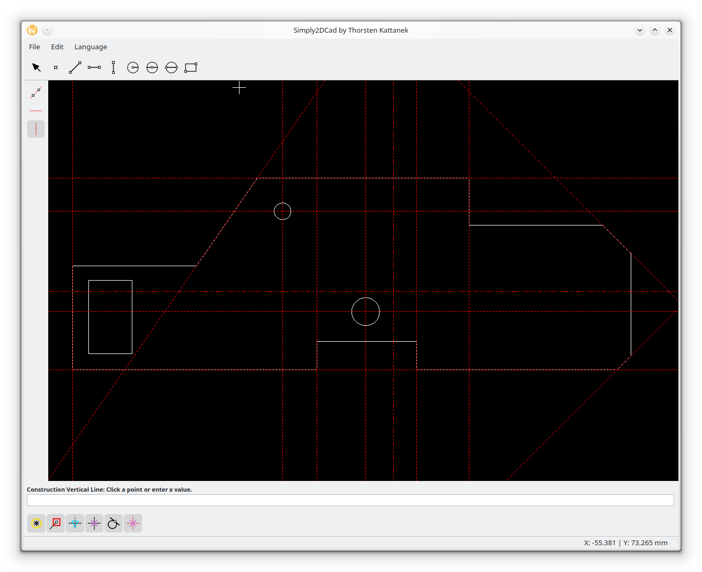

# Simply2DCad
Update *.ts files with: cmake --build [BUILD_DIRECTORY] --target simply_2d_cad_lupdate  
  
## Screenshots  

## License

This project is licensed under the MIT License - see the [LICENSE](LICENSE) file for details.

## Acknowledgments

*   A very special thanks to **The Qt Company** for developing and maintaining the excellent **Qt Framework**. Their powerful platform made developing this CAD application a smooth and enjoyable experience.
*   Thanks to **RibbonSoft** for providing the **dxflib**, enabling standard-compliant DXF support.
*   Thanks to the open-source community for countless libraries, tutorials, and inspiration.