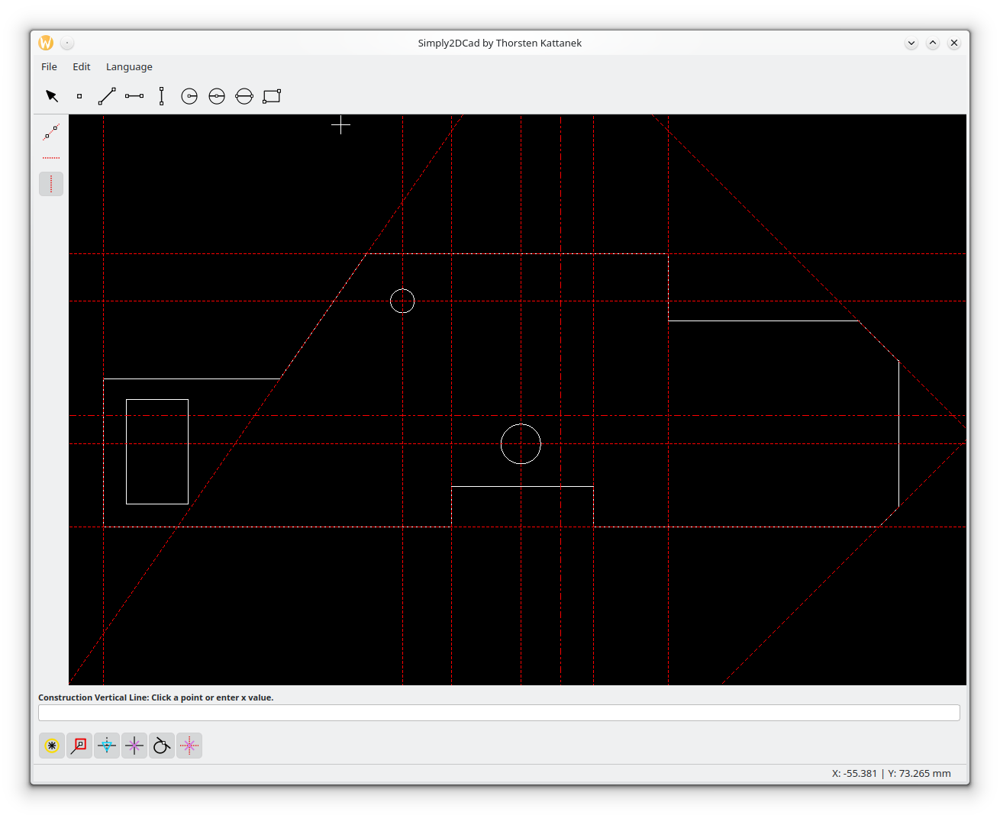

// Simply 2D CAD
// Copyright (C) 2026 Thorsten Kattanek

// This program is free software; you can redistribute it and/or modify
// it under the terms of the GNU General Public License as published by
// the Free Software Foundation; either version 2 of the License, or
// (at your option) any later version.

= Simply 2D CAD – Benutzerhandbuch
Thorsten Kattanek
v1.0, {docdate}
:doctype: book
:toc: left
:toclevels: 2
:toc-title: Inhaltsverzeichnis
:icons: font
:experimental:
:imagesdir: ../images
:icon-dir: ../../../src/icons_svg

== Einführung
Willkommen im Benutzerhandbuch von Simply 2D CAD!

Es freut mich sehr, dass du dich für diese Software entschieden hast. Simply 2D CAD ist ein einfaches, aber leistungsfähiges Zeichenprogramm, das speziell für das schnelle Konstruieren von 2D-Teilen entwickelt wurde.

Ich habe das Programm ursprünglich für meinen eigenen Bedarf entwickelt, um eine schlanke Alternative zum CAD-Modul von TruTops zu haben. Es eignet sich optimal, um Blechteile zu entwerfen und die generierten DXF-Dateien direkt in nachfolgende Anwendungen zu importieren.

Der Umstieg von TruTops CAD zu Simply 2D CAD ist bewusst einfach gehalten, sodass du dich sofort zurechtfinden wirst. Die Benutzeroberfläche ist intuitiv gestaltet und die Werkzeuge sind so konzipiert, dass sie deinen Arbeitsablauf optimal unterstützen.

NOTE: **Für TruTops-Umsteiger:** Das arbeiten mit Hilslinien funktioniert in Simply 2D CAD genauso wie in TruTops.

Dieses Handbuch hilft dir dabei, die Funktionen und Werkzeuge von Simply 2D CAD schnell zu verstehen und effektiv einzusetzen.

== Grundlegende Navigation
* *Pan (Verschieben):* Halte die mittlere Maustaste gedrückt und bewege die Maus.
* *Zoom:* Halte die rechte Maustaste gedrückt und bewege die Maus nach oben (rein zoome) oder unten (raus zoomen).

== Tastenkombinationen & Werkzeuge
Im Zeichenfenster kannst du Werkzeuge direkt über Tastenkürzel aufrufen:

* kbd:[L] – Linie zeichnen
* kbd:[C] – Kreis (Zentrum & Durchmesser)
* kbd:[S] – Auswahl-Werkzeug

[NOTE]
.Pro-Tipp
Tippe einfach eine Zahl oder Koordinate (z. B. `10,20` oder `100<45`), um direkt Werte in die Befehlszeile einzugeben.

== Zeichenwerkzeuge
include::tools/line_2points.adoc[]